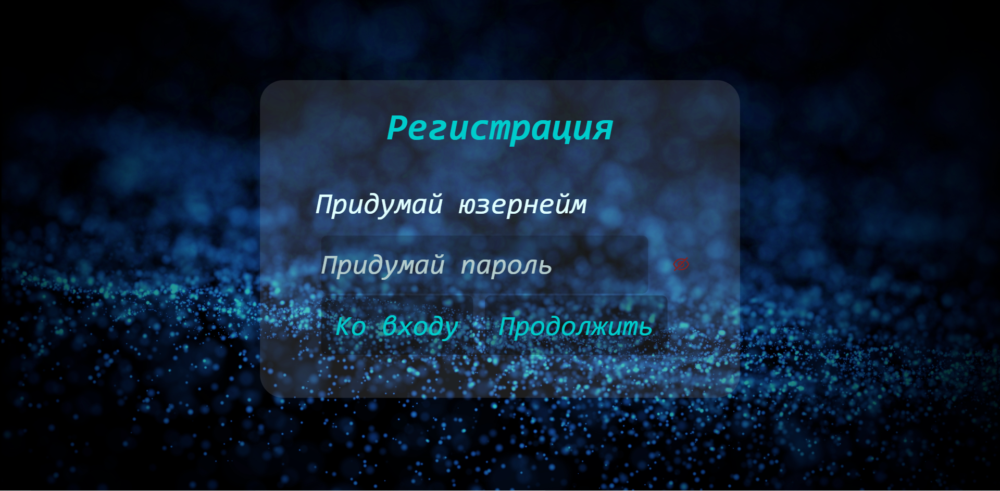
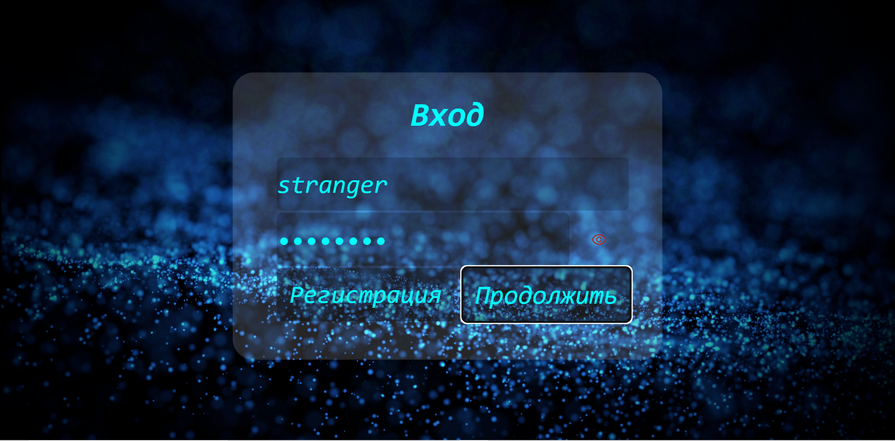
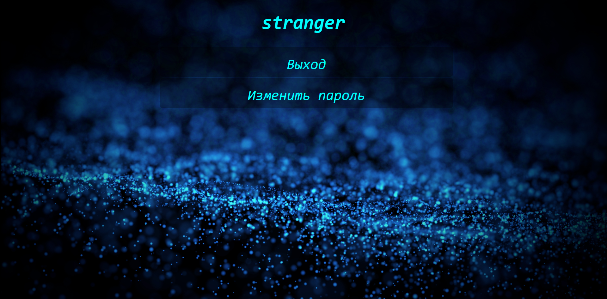
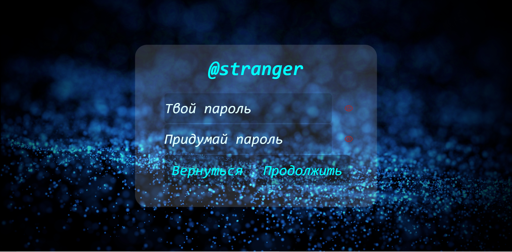
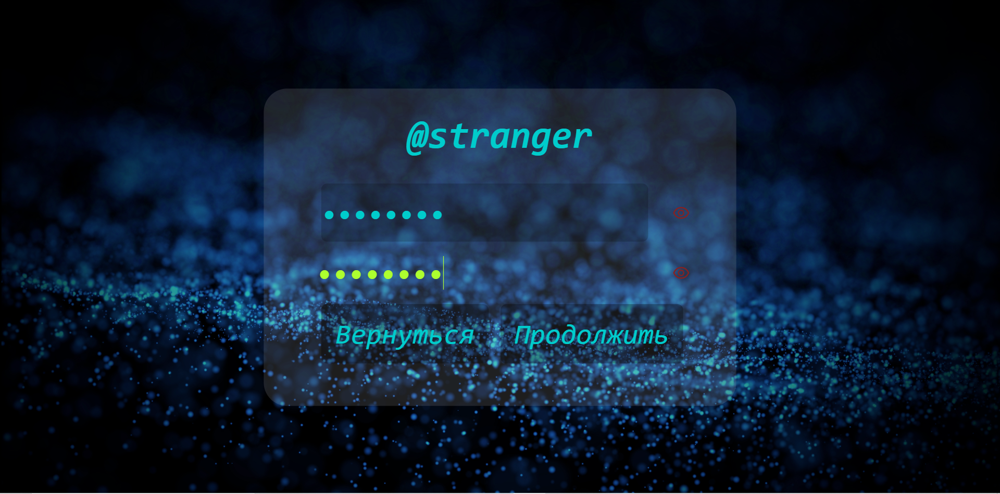
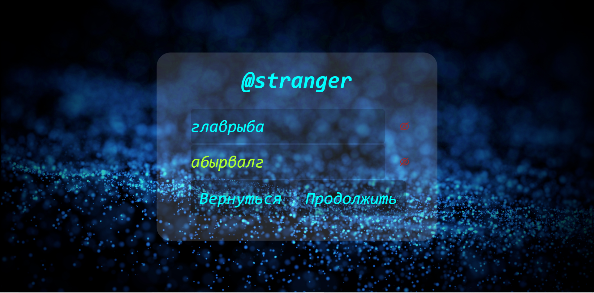

# L1. HTTP-аутентификация

# Задание
Спроектировать и разработать систему авторизации пользователей на протоколе HTTP
## Минимальные требования
- функциональность входа/выхода
- хранение паролей в хэшированном виде 
## Дополнительные возможности
- форма регистрации
- смена пароля
- восстановление пароля
- ограничение времени сессии (на сервере)
- ограничение срока действия пароля (на сервере)
- валидация пароля (на сервере)
- хранение хэша пароля с солью
- возможность одновременного использования пользователем нескольких клиентов
## Выполнено
- функциональность входа/выхода
- хранение паролей в хэшированном виде
- форма регистрации
- смена пароля
- ограничение времени сессии (на сервере)
- валидация пароля (на сервере)
- хранение хэша пароля с солью 
- возможность одновременного использования пользователем нескольких клиентов


# Ход работы

## Пользовательский интерфейс
### 1. Страница регистрации

### 2. Страница входа

### 3. Страница пользователя

### 4.1. Страница смены пароля

### 4.2. Страница смены пароля со скрытыми полями

### 4.3. Страница смены пароля с видимыми полями


## Пользовательские сценарии работы
### /
Перенаправляет на `/@:username`, если пользователь зарегистрирован, иначе на `/login`
### /login
Форма входа
### /signup
Форма регистрации
### /@:username
Страница пользователя с именем username. Если это личная страница пользователя, также показывает кнопки выхода и смены пароля. Если такого пользователя нет, выводит сообщение "Пользователь не найден"
### /change-password
Страница изменения пароля. Если пользователь не вошёл, выводится соответсвующее сообщение и кнопки перехода ко входу/регистрации

## Описание API сервера, хореографии
### POST /api/new-user/
Создание нового пользователя с определённым именем и паролем. Проверяет, чтобы юзернейм был уникален, состоял из как минимум `5` маленьких букв латинского алфавита, цифр, знаков точки и нижнего подчёркивания, а также не начинался с цифры. Кроме того, проверяет, чтобы пароль состоял из как минимум `8` символов, из которых было хотя бы `5` уникальных. Пароль конкатенируется со случайной однажды созданной солью, хэшируется с помощью SHA256 и таким образом хранится в БД. Присылает ID пользователя
### POST /api/login/
Вход по имени пользователя и паролю. Присылает ID пользователя
### POST /api/change-password/
Смена пароля
### POST /api/logout/
Окончание сессии
### GET /api/username-taken/
Проверка, существует ли такое-то имя

## Структура базы данных
В качестве базы данных используется **BadgerDB**
### UserAuth
По ID пользователя возвращается 64 байта: 32 случайной соли, 32 для SHA256
### Username
По имени пользователя возвращается его идентификатор
### UserInfo
По идентификатору пользователя возвращается информация о нём в формате **JSON**. Содержит единственное поле: `username`

# Значимые франменты кода
## 1. Алгоритм авторизации
```go
func Login(c *gin.Context) {
	username := c.Request.URL.Query().Get(consts.ParamUsername)
	passwordUrl := c.Request.URL.Query().Get(consts.ParamPassword)
	password, err := utils.PasswordFromUrlEncoding(passwordUrl)

	if err != nil || !utils.UsernameIsValid(username) || !utils.PasswordIsStrong(password) {
		reterror.InvalidUsernameOrPassword(c)
		return
	}

	user, err := db.GetUser(username)
	if err != nil {
		if errors.Is(err, db.ErrorUserNotFound) {
			retcommand.NotFound(c)
			return
		}
		reterror.PanicInternal(c, err)
	}

	authorized, err := user.Authorize(password)
	if err != nil {
		if errors.Is(err, db.ErrorIncorrectPassword) {
			retcommand.NotFound(c)
			return
		}
		reterror.PanicInternal(c, err)
	}

	shared.GiveCookie(c, authorized)
	retcommand.Data(c, authorized.H())
}
```
## 2. Алгоритм регистрации
```go
func NewUser(c *gin.Context) {
	username := c.Request.URL.Query().Get(consts.ParamUsername)
	passwordUrl := c.Request.URL.Query().Get(consts.ParamPassword)
	password, err := utils.PasswordFromUrlEncoding(passwordUrl)

	if err != nil || !utils.UsernameIsValid(username) || !utils.PasswordIsStrong(password) {
		reterror.InvalidUsernameOrPassword(c)
		return
	}

	authorized, err := db.NewUser(username, password)
	if err != nil {
		if errors.Is(err, db.ErrorUsernameTaken) {
			retcommand.Deny(c)
			return
		}
		reterror.PanicInternal(c, err)
	}

	shared.GiveCookie(c, authorized)
	retcommand.Data(c, authorized.H())
}
```
## 3. Алгоритм смены пароля
```go
func ChangePassword(c *gin.Context) {
	token, err := c.Cookie(consts.CookieSessionId)
	if err != nil {
		if errors.Is(err, http.ErrNoCookie) {
			reterror.NoSessionId(c)
			return
		}

		reterror.PanicInternal(c, err)
	}

	_, ok := cookie.GetUsername(token)
	if !ok {
		reterror.InvalidSessionId(c)
		return
	}

	passwordUrl := c.Request.URL.Query().Get(consts.ParamPassword)
	password, err := utils.PasswordFromUrlEncoding(passwordUrl)
	if err != nil {
		reterror.InvalidUsernameOrPassword(c)
		return
	}

	newPasswordUrl := c.Request.URL.Query().Get(consts.ParamNewPassword)
	newPassword, err := utils.PasswordFromUrlEncoding(newPasswordUrl)
	if err != nil {
		reterror.InvalidUsernameOrPassword(c)
		return
	}

	userIdString := c.Request.URL.Query().Get(consts.ParamUserId)
	userId, err := strconv.ParseUint(userIdString, 10, 64)
	if err != nil {
		retcommand.NotFound(c)
		return
	}

	if !utils.PasswordIsStrong(password) || !utils.PasswordIsStrong(newPassword) {
		reterror.InvalidUsernameOrPassword(c)
		return
	}

	authorized, err := db.ChangePassword(userId, password, newPassword)
	if err != nil {
		if errors.Is(err, db.ErrorUserNotFound) {
			retcommand.NotFound(c)
			return
		}

		if errors.Is(err, db.ErrorIncorrectPassword) {
			retcommand.NotFound(c)
			return
		}

		reterror.PanicInternal(c, err)
	}

	cookie.Delete(token)
	shared.GiveCookie(c, authorized)
	retcommand.Data(c, authorized.H())
}
```
## 4. Алгоритм выхода
```go
func Logout(c *gin.Context) {
	token, err := c.Cookie(consts.CookieSessionId)
	if err != nil {
		if errors.Is(err, http.ErrNoCookie) {
			reterror.NoSessionId(c)
			return
		}

		reterror.PanicInternal(c, err)
	}

	if _, ok := cookie.GetUsername(token); !ok {
		reterror.NoSessionId(c)
		return
	}

	cookie.Delete(token)
	c.SetCookie(consts.CookieSessionId, "", -1, "/", env.Domain(), false, true)
	retcommand.Success(c)
}
```
